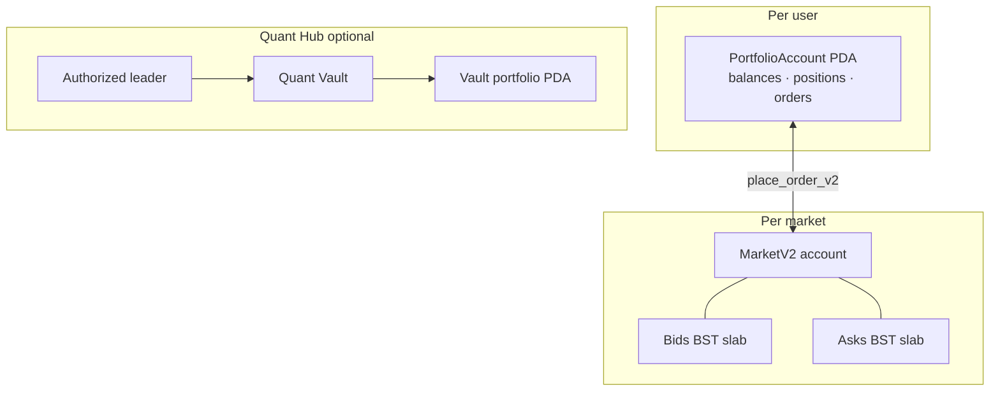

# Unified zero-copy portfolio

QuantDesk V2 introduces a **unified zero-copy portfolio** architecture. Unlike V1, which managed separate Program Derived Addresses (PDAs) for balances, positions, and orders, V2 consolidates all trader state into a single, high-performance account.

## The V1 to V2 shift

### V1: fragmented state

In V1, every position and open order required its own account creation and rent payment. This led to:

- **Higher latency:** multiple RPC calls to fetch complete state.
- **Complexity:** higher risk of state divergence.
- **Cost:** multiple rent-exempt deposits.

### V2: the unified advantage

V2 uses a single `PortfolioAccount` PDA that acts as a high-density, zero-copy buffer.

- **Atomic execution:** balances, positions, and open orders update in a single transaction.
- **Sub-ms parsing:** with zero-copy (via `bytemuck`), the UI and bots read the entire account state without expensive deserialization.
- **Deterministic PDAs:** each user has one `PortfolioAccount` per subaccount index, derived from `[portfolio, wallet_pubkey, subaccount_index]` seeds.

## Architectural benefits

### Performance

Zero-copy means the SBF program interacts directly with the account's memory. For you, that means faster order placement and liquidation protection.

### Reliability

With all state consolidated, there is no "position drift." If the account exists, the state is consistent across balances, margins, and active trades.

### Devnet readiness

The V2 unified portfolio is the core of our devnet deployment, so what you see in the terminal is a faithful representation of your on-chain state.

## Execution and matching

V2 pairs the unified portfolio with **crankless on-chain matching** — trades settle atomically against BST order-book slabs inside each `MarketV2` account. For execution flow, seat gates, and depth reading, see [Reading the order book](../trading/order-book#v2-crankless-bst-matching).

## Architecture diagram (V2 unified model)

This replaces the V1 pattern of separate position PDAs per trade. One portfolio, one atomic update path.
