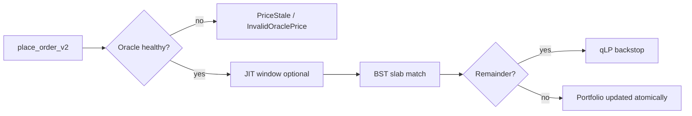

# Reading the order book

The order book is execution context, not certainty.

## V2: on-chain BST depth

In QuantDesk V2, displayed depth comes from **crankless BST slabs** — bid and ask red-black trees stored inside each `MarketV2` account. Matches happen atomically in `place_order_v2` without waiting for an off-chain keeper.

Integrators can fetch aggregated depth via:

```bash
curl -s "$QD_API/api/v2/markets/orderbook/SOL-PERP" | jq .
```

See [V2 API endpoints](../developers/api-v2) for response fields and cache behavior (`redis` vs database fallback).

## V2 crankless BST matching

V1 relied on hybrid models where off-chain keepers could delay or batch matching. V2 moves matching **on-chain** into a bounded Binary Search Tree (BST) slab per market side (bids and asks).

### V1 vs V2 execution

| Aspect | V1 (legacy) | V2 (current) |
| --- | --- | --- |
| Order book | Fragmented / keeper-dependent | Dual BST slabs in one `MarketV2` account |
| Matching | Multi-step, higher latency | Atomic in `place_order_v2` |
| State reads | Multiple PDAs per user | Single `PortfolioAccount` zero-copy buffer |
| Social trades | Ad hoc guards | 100bps oracle band enforced in-program |

### How a trade flows



**Key properties:**

- **No crank for core fills** — takers match against resting liquidity in the same transaction they submit.
- **Bounded slabs** — each side caps at 256 nodes so compute stays within Solana CU limits.
- **Seat gate** — makers claim a `MarketSeat` PDA before posting limit orders (spam protection).

For the integrator tutorial, see [Building on QuantDesk](../developers/building-on-quantdesk). For portfolio state layout, see [Unified portfolio architecture](../overview/unified-portfolio).

## What to watch

- **Spread**: tighter is usually easier execution
- **Near depth**: more depth can reduce slippage
- **Imbalance**: useful context, not a standalone signal

## Practical habits

1. Check spread before urgent orders
2. Compare size against near depth
3. Prefer staged entries in thin liquidity
4. Re-evaluate after partial fills
